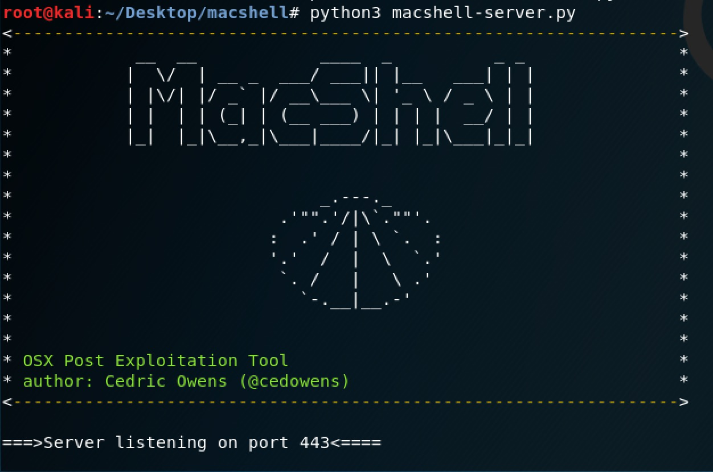
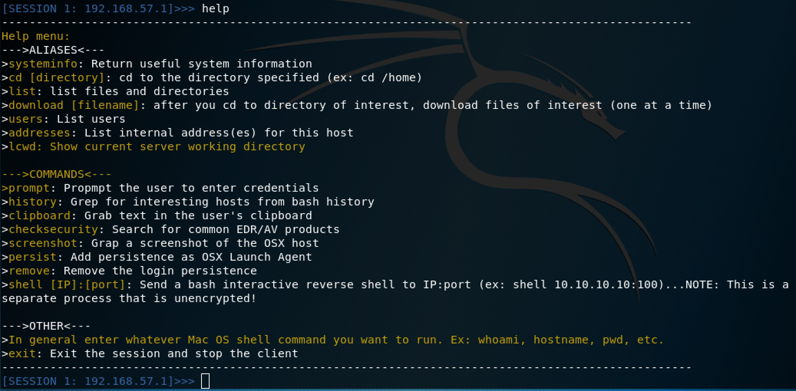
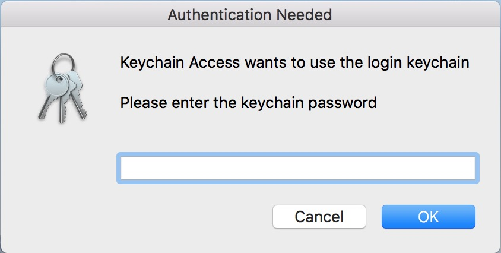

# MacShell

MacShell is a macOS post exploitation tool written in python using encrypted sockets. This tool consists of two scripts: a server script and a client script.

More info below:

**_On C2 Server:_**

1. Set up ssl

-openssl req -new -newkey rsa:1024 -nodes -out ca.csr -keyout ca.key
 

-openssl x509 -trustout -signkey ca.key -days 365 -req -in ca.csr -out ca.pem

_*note: the server script is hard-coded to use ca.pem and ca.key, so keep these names the same for now_

2. Use generator.py to create the macshell scripts with the server's IP and port. generator.py also builds a macro that you can copy and paste into an MS Office document:

Usage: generatory.py -s <C2 Server IP> -p <C2 Server Port>
-Example:

3. Start the generated macshell-server.py script to listen for a connection:

On Client-Side (the mac you want to control):
1. Copy the macshell-client.py script to the client (as this is a post exploitation tool, it is assumed that you have some level of shell access)

2. On the client, run the macshell-client.py script:

3. On the server, you will see an inbound connection. Example below:

***Using MacShell***

1. After you receive a connection, you can use the "help" command on the server to get a list of built-in commands available. You can enter one of these commands or a shell command (ex: whoami or id)

Each command is pretty straightforward. A few of my favorite commands that I wanted to highlight are below.

**prompt** Command: This will pop up a fake Keychain authentication prompt asking the user to authenticate with their keychain password. Either the user will cancel the prompt or enter their password. The results are sent back to the server.

Here is what the fake authentication prompt looks like:

And here is an example of credentials being captured and sent to the server:

**history** Command: Greps the bash history file on the target and then returns interesting IP addresses (ex: machines that the user may have ssh'd to)

**clipboard** Command: Returns the results of what is currently on the user's clipboard

**persist** Command: Uses Launch Agent persistence

**remove** Command: removes the Launch Agent persistence

**connections** Command: View processes with network connections

**addresses** Command: Get a list of internal addresses assigned to the macOS host

**uesrs** Command: Get a list of user accounts on the macOS host

**download** Command: Download file of interest from the macOS host (note: user context must have the needed permissions)

**checksecurity** Command: Check for some common EDR/AV vendors on the macOS host

----------

**_Limitations_**

-While the server does accept multiple client connections, you cannot jump between sessions currently. The server will interact with the first session it receives and once the operator exits that session it will move on to the next session in the queue.

-I have only developed an MS Office Macro payload generator for this tool. Other types of payloads are also possible.

-When the macro is used to phish and gain access, the user context is limited and all functions do not work. In that scenario you can use the "systeminfo", "users", and "addresses" commands to get basic info and the "prompt" commands to attempt to get creds.

-----------

**_DISCLAIMER_**

This is for academic purposes and should not be used maliciously or without the appropriate authorizations and approvals.
